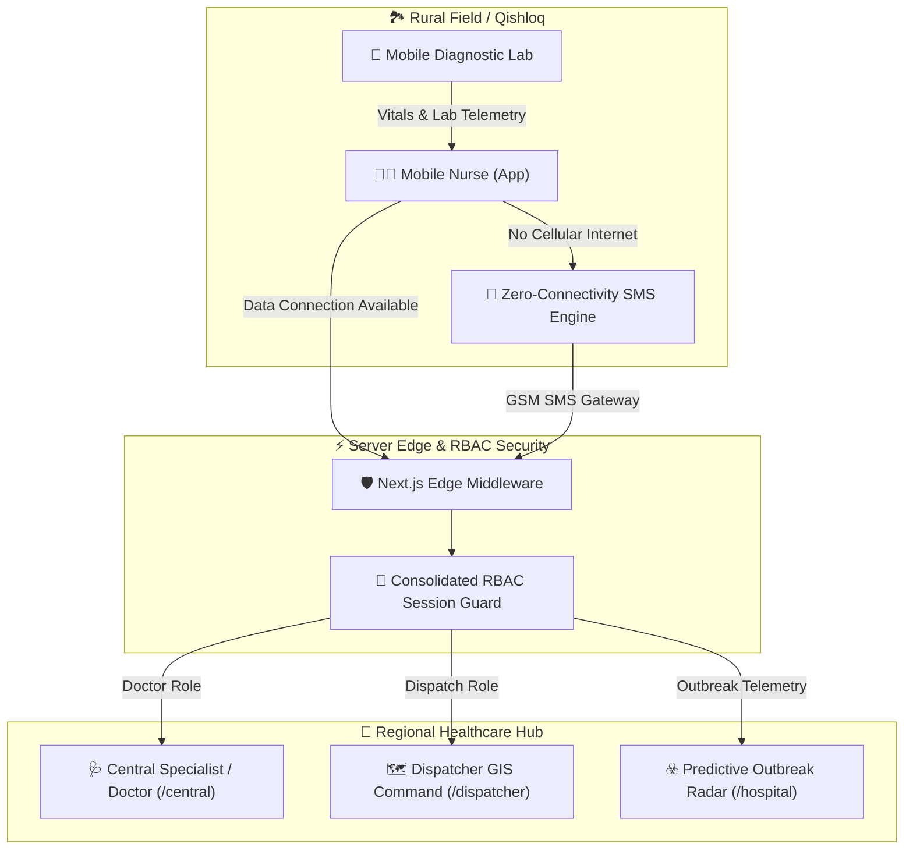

# 🏥 Tomir: Qishloq Med AI — Rural Clinical Coordination Platform

[](https://github.com/umaraxmedov0175-alt/QishloqMedAI)
[](https://www.typescriptlang.org/)
[](https://nextjs.org/)
[](https://workers.cloudflare.com/)
[](https://github.com/umaraxmedov0175-alt/QishloqMedAI)

> **Tomir (Томир / Vena)** — *Enterprise-grade, offline-first clinical triage, diagnostic telemetry, and regional emergency response platform designed specifically for Uzbekistan's rural primary healthcare network (SVP / OVP).*

---

## 📌 Executive Summary

Rural healthcare delivery across the regions of Uzbekistan (Fergana Valley, Surkhandarya, Karakalpakstan, Samarkand) faces severe challenges:
1. **Geographical & Infrastructure Isolation:** Sporadic 2G/3G network connectivity in remote mountainous villages (*qishloqs*).
2. **Clinical Specialist Deficit:** High ratio of patients to specialist doctors in rural primary care centers (*Qishloq Oila Shifokorlik Punktlari*).
3. **Emergency Dispatch Delays:** Critical delays in dispatching mobile emergency medical units to acute cardiovascular or respiratory cases.

**Tomir: Qishloq Med AI** bridges this gap by empowering field mobile nurses with AI-assisted clinical triage protocols, point-of-care mobile laboratory telemetry, zero-connectivity SMS payload encoding, and direct geospatial dispatching to the nearest regional hospital.

---

## 🚀 Key Architectural Innovations

### 🗺️ 1. Nearest Regional Hospital Proximity Routing Engine
- Computes Haversine spherical distance between patient GPS coordinates and regional medical authorities across Uzbekistan (Tashkent Regional, Samarkand Emergency, Fergana Regional, Bukhara, Namangan, Andijan Medical Centers).
- Automatically selects the nearest capable medical facility with available bed capacity rather than defaulting to capital hospital routes.

### 🧪 2. Point-of-Care Mobile Diagnostic Laboratory Integration
- Ingests telemetry from field diagnostic equipment:
  - **Point-of-care Blood Analyzer** (Glucose, Hemoglobin, Troponin-I, Lactate, SpO2)
  - **Portable 12-lead ECG Monitor**
  - **Handheld Ultrasound (USG)**
- Automatically evaluates critical lab thresholds (e.g. Troponin-I positive > 0.04 ng/mL, Severe Hypoglycemia < 3.0 mmol/L) and incorporates vitals directly into AI risk stratification.

### 🔒 3. Isolated Role-Based Access Control (RBAC) Architecture
- Strict server-side Next.js Edge Middleware ([`middleware.ts`](file:///c:/Users/Umar/QishloqMedAI/middleware.ts)) and client-side route guards ([`app/ui/RoleGuard.tsx`](file:///c:/Users/Umar/QishloqMedAI/app/ui/RoleGuard.tsx)) enforce hard boundaries across 4 protected role workspaces:
  - **`Doctor`**: Specialist queue, evidence-first review, regional hospital beds (`/central`, `/hospital/outbreak`)
  - **`Nurse`**: Mobile intake, 7-step guided protocol, offline sync queue (`/mobile`, `/offline`)
  - **`Dispatch`**: Real-time GIS map, emergency dispatching, outbreak radar (`/dispatcher`, `/dispatcher/radar`, `/operations`)
  - **`Patient`**: Isolated patient portal, medical request intake (`/patient`, `/patient/report`)

### 💬 4. LinkedIn-Style Inner Teleconsultation Chat & Privacy Redaction
- Unattached floating draggable chat widget ([`MovableChatWidget.tsx`](file:///c:/Users/Umar/QishloqMedAI/app/ui/MovableChatWidget.tsx)) supporting real-time teleconsultation between nurses, specialists, and dispatchers.
- **Privacy Engine**: Automatic real-time redaction of phone numbers and PII in Uzbekistan (`+998 XX XXX-XX-XX`) and international formats.

### ☣️ 5. Predictive Regional Outbreak Radar
- Statistical Z-score calculation and spatial density clustering algorithm ([`lib/outbreak-radar.ts`](file:///c:/Users/Umar/QishloqMedAI/lib/outbreak-radar.ts)) detecting localized outbreak anomalies (e.g. Waterborne Gastroenteritis, Viral Hepatitis) before epidemic spikes occur.

### ⚡ 6. Zero-Connectivity SMS/Mesh Serialization Payload Engine
- Encodes clinical vitals (SBP, DBP, Heart Rate, SpO2, Temp, Glucose, ECG rhythm code, CRC-16 checksum) into a compact **64-character payload** string ([`lib/zero-connectivity-payload.ts`](file:///c:/Users/Umar/QishloqMedAI/lib/zero-connectivity-payload.ts)).
- Enables transmission over basic GSM SMS when cellular internet data is completely unviable.

---

## 🏗️ System Architecture Diagram



---

## 💻 Protected Workspace Workspaces

| Workspace | Role Key | Authorized Paths | Key Capabilities |
| :--- | :--- | :--- | :--- |
| **Specialist Doctor** | `doctor` | `/central`, `/hospital/outbreak` | Evidence-first review, gold-standard triage comparison, DICOM scan viewer, clinical decision storage |
| **Mobile Nurse** | `nurse` | `/mobile`, `/offline` | 7-step guided clinical intake, mobile lab equipment inputs, durable IndexedDB offline queue |
| **Dispatcher GIS** | `dispatcher` | `/dispatcher`, `/dispatcher/radar`, `/operations` | Live ambulance tracking, spatial density cluster radar, regional hospital bed capacity management |
| **Patient Portal** | `patient` | `/patient`, `/patient/report` | Isolated patient intake, medical report history, privacy-sanitized consultation logs |

---

## 🛠️ Local Development & Quick Start

### Prerequisites
- Node.js 20+ (LTS)
- npm 10+

### Step 1: Install Dependencies
```bash
npm ci
```

### Step 2: Configure Environment Variables
```bash
cp .env.example .env.local
```

### Step 3: Launch Local Development Server
```bash
npm run dev
```
Open [http://localhost:3000](http://localhost:3000) in your browser.

---

## 🧪 Quality Gates & Automated Audits

Run the full automated self-correcting quality suite before submitting changes:

```bash
# 1. Run full unit test suite (46 passing test files)
npm test

# 2. Run strict TypeScript compiler verification
npm run typecheck

# 3. Run ESLint code quality inspection
npm run lint

# 4. Run local Vinext build
npm run build

# 5. Run Vercel Next.js production build
npm run build:vercel
```

---

## ⚖️ Legal & Medical Disclaimer

> **Medical Use Disclaimer:** *Tomir: Qishloq Med AI is a synthetic demonstration platform engineered for hackathon evaluation and prototype testing. It is not a certified medical device under FDA/CE or Ministry of Health regulation. All patient encounters, vitals, and diagnostic scans contained within this repository represent synthetic demonstration data. Clinical AI recommendations are preliminary decision support tools and must always require licensed physician review.*
